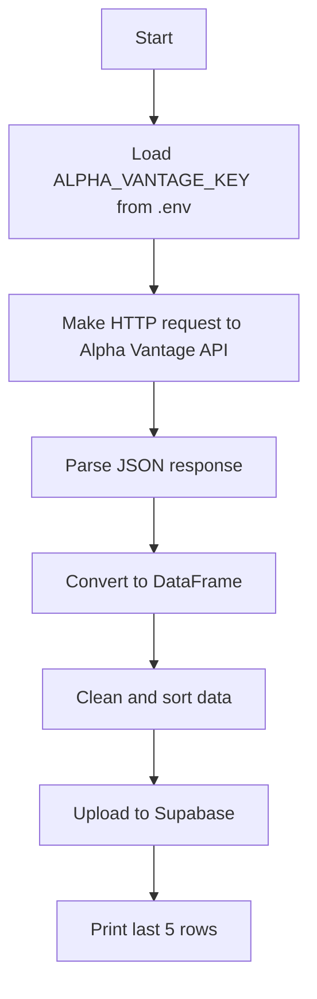

ml_pipeline/src/ml/data_fetcher.md
markdown

# 📊 `data_fetcher.py`

This module fetches **intraday stock price data** from the [Alpha Vantage API](https://www.alphavantage.co/documentation/) and uploads it to Supabase. It also prints the latest 5 rows of data for validation.

---

## 📁 Location

src/ml/data_fetcher.py

_Run via:_
```bash
python -m src.ml.data_fetcher

---
## 📈 Process Flow


```
---
## Process Flow
---

---


Function: fetch_stock_data(...)

Fetches intraday time series stock data for a given symbol and returns it as a pandas DataFrame.

**Parameters**
ticker (str): Stock symbol to query (e.g. "AAPL").

**interval** (str, default: "60min"):
Time interval for intraday data. Options: "1min", "5min", "15min", "30min", "60min".

**outputsize** (str, default: "compact"):
"compact" = last 100 data points, "full" = entire history.

**Returns**
pd.DataFrame: Cleaned, chronologically sorted stock price data with columns:

**open, high, low, close, volume**

If the API call fails or the data is invalid, returns an empty DataFrame.

📦 **Dependencies**
pandas
requests
python-dotenv
Local module: supabase_uploader.upload_to_supabase()

**Environment Variables**
These must be defined in a **.env** file at the project root:
ALPHA_VANTAGE_KEY: Your Alpha Vantage API key.

**Main Script Behavior**
When run directly (e.g., via CLI):
    $ python -m src.ml.data_fetcher

It will:
Fetch 60min intraday data for "AAPL"
Upload the result to Supabase
Print the last 5 rows of the resulting DataFrame

⚠️ Error Handling
Gracefully handles and logs:
❌ Missing API key
❌ HTTP/network failures
❌ Malformed or unexpected API responses
📤 Example Usage

$ python -m src.ml.data_fetcher
📡 Fetching data for AAPL...
✅ 100 rows fetched for AAPL

    open   high    low  close   volume
    ...    ...     ...   ...     ...

🧩 Related Files
supabase_uploader.py: Handles uploading the DataFrame to Supabase.
.env: Must contain your ALPHA_VANTAGE_KEY.

✅ **Notes**
Alpha Vantage free tier limits: 5 API calls per minute, 500 per day.

Best used in automated data pipelines or on-demand analysis.


---
